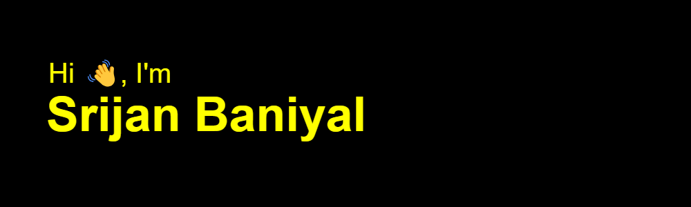

# My Badges

<Br />
<Br />

[](https://holopin.io/@srijanbaniyal)

```javascript
while (bored === true) {
  if (level === 1) {
    readDocs();
  } else if (level == 2) {
    FigmaDesigning();
  } else if (level === 3) {
    listenMusic();
  } else {
    sleep();
  }
}
```

<p align="center">
  <a href="https://git.io/typing-svg"></a>
</p>

<!--START_SECTION:waka-->

```TypeScript
From: 30 September 2025 - To: 30 October 2025

Total Time: 8 hrs 33 mins

TypeScript     6 hrs 2 mins    █████████████████▓░░░░░░░   70.57 %
Markdown       30 mins         █▓░░░░░░░░░░░░░░░░░░░░░░░   06.00 %
Python         30 mins         █▒░░░░░░░░░░░░░░░░░░░░░░░   05.94 %
C++            29 mins         █▒░░░░░░░░░░░░░░░░░░░░░░░   05.78 %
JSON           18 mins         █░░░░░░░░░░░░░░░░░░░░░░░░   03.59 %
jsonc          12 mins         ▓░░░░░░░░░░░░░░░░░░░░░░░░   02.52 %
C              7 mins          ▒░░░░░░░░░░░░░░░░░░░░░░░░   01.39 %
CSS            6 mins          ▒░░░░░░░░░░░░░░░░░░░░░░░░   01.21 %
Text           3 mins          ▒░░░░░░░░░░░░░░░░░░░░░░░░   00.71 %
Other          3 mins          ░░░░░░░░░░░░░░░░░░░░░░░░░   00.60 %
JavaScript     2 mins          ░░░░░░░░░░░░░░░░░░░░░░░░░   00.51 %
git ignore     1 min           ░░░░░░░░░░░░░░░░░░░░░░░░░   00.39 %
TSConfig       1 min           ░░░░░░░░░░░░░░░░░░░░░░░░░   00.30 %
shell script   1 min           ░░░░░░░░░░░░░░░░░░░░░░░░░   00.28 %
Bash           1 min           ░░░░░░░░░░░░░░░░░░░░░░░░░   00.21 %
Git Config     0 secs          ░░░░░░░░░░░░░░░░░░░░░░░░░   00.00 %
YAML           0 secs          ░░░░░░░░░░░░░░░░░░░░░░░░░   00.00 %
```

<!--END_SECTION:waka-->

<Br />
<Br />


